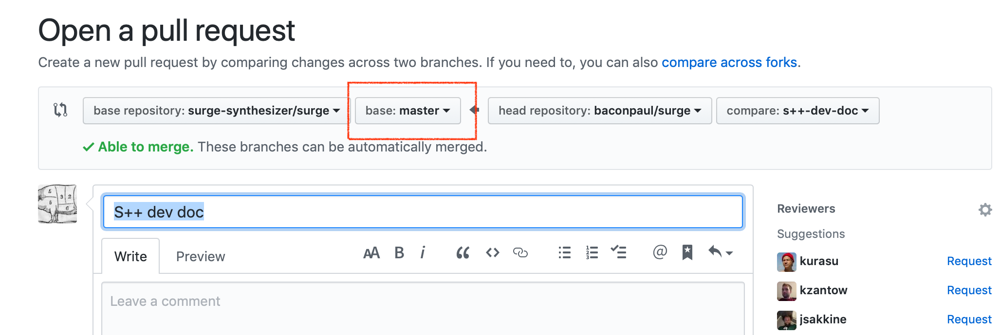
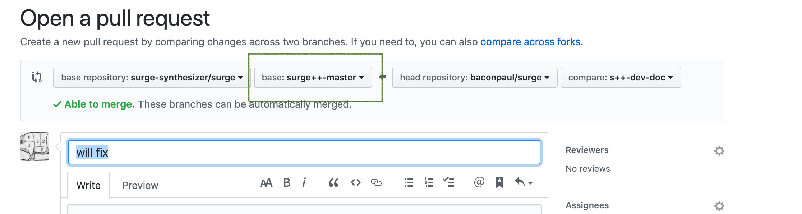

# Developing Surge++

This is an on-branch document with tips for developing Surge++. It assumes you've already read
the git howto and can build surge proper and stuff. If not check other docs in this directory.

## Git Mechanics

surge++ is a git branch at https://github.com/surge-synthesizer/surge/ called `surge++-master`.
This means you need to develop and PR into that branch rather than `master`. Since we are still
actively developing surge, `master` will continue to change and one of us will merge back and forth.

Practically this means the following:

### Keeping your fork up to date

Once you fork surge, you will need to keep s++ up to date just like you do master. To do this you 
need to pull the upstream and apply it to your fork on the branch.

So once (and only once) add an upstream remote to your checked out repo

```
git remote add upstream https://github.com/surge-synthesizer/surge.github
```

then when you want to update the surge++-master branch in your fork to upstream
run the following commands (which @baconpaul keeps around as a script):

```
#!/bin/bash
set -e

git diff --exit-code
git diff --cached --exit-code
git checkout surge++-master
git fetch upstream
git reset upstream/surge++-master --hard
git push origin surge++-master
```

You can see this makes sure you don't have any local changes, heads over to your
local s++ branch, grabs upstream, resets to upstream, and pushes.

In order for this to work, though, you have to follow our cardinal git rule which is
*never develop on a master branch*. So on to....

### Adding a change

We want to continue using pull requests against surge++-master as our working model and using
a user-branch per request semantic. Assume that your fork has an up to date surge++-master, what
does that mean?

Well if you are, say, moving the lfo envelope sliders you could do this

```
git checkout surge++-master   # this places you on the s++ branch which is up to date per above
git checkout -b lfo-envelope-sliders  # this creates a branch for lfo envelope sliders
(develop, test, develop, test)
git commit
  # at this point write a good commit message. See the git-howto for guidelines
git push origin lfo-envelope-sliders
```

OK so that's all the same. Github will almost definitely respond with a message saying something like

```
remote: Create a pull request for 's++-dev-doc' on GitHub by visiting:
remote:      https://github.com/baconpaul/surge/pull/new/s++-dev-doc
```

so open that URL. And now here is the *crucial difference between surge and surge*. Since our github repo
has master set as the default branch all pull requests will default to master. If you submit a pull request
against master nothing will break, but certainly we won't be able to merge it. So you need to change the
target branch for your PR.

The default screen will look like this, with the error highlighted in red



You need to change that master target to be the surge++-master



and then the pull request will be correctly configured.

# Is anything else different?

Well yeah loads of other things are different. That's the point! But as far as developer mechanics
no. Follow the rules in git-howto (like try to have a github issue for your commits and so on)
and have fun!


